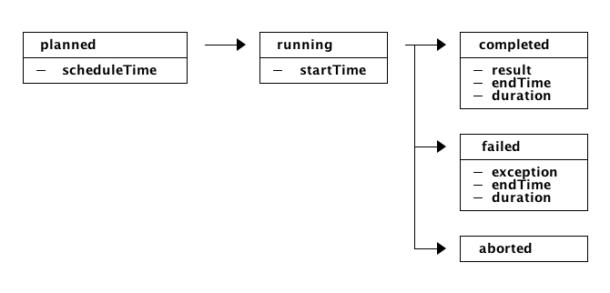

Welcome to php-task's documentation!
====================================
PHP-Task provides a simple to use task-scheduling library. It provides an array
storage for simple usecases. In case your are using the
:doc:`symfony-bundle<symfony>` you can also use the doctrine-storage which
persists the tasks in a simple database structure.

Basic Ideas
-----------
The basic idea behind the library is to decouple the scheduling and running the
tasks. The scheduling is done by a ``TaskScheduler`` which stores Tasks and
schedule its executions. This executions will be executed by the ``TaskRunner``.

Each Execution has a lifecycle with following state-machine:

This decoupled architectures allows you schedule recurring tasks. To define this
tasks you can use `Cron Expression`_ to define when and how often (e.g. each
Tuesday on 12am) the task should run.

After each execution the ``TaskScheduler`` will be called to schedule a new
execution for the recurring task. This allows to persist the history of
executions and make statistics over results, statuses and durations.

Contents
--------

.. toctree::
    :maxdepth: 2

    components
    locking
    retry
    quick-example
    symfony

Indices and tables
==================

* :ref:`genindex`
* :ref:`modindex`
* :ref:`search`

.. _Cron Expression: https://github.com/mtdowling/cron-expression
